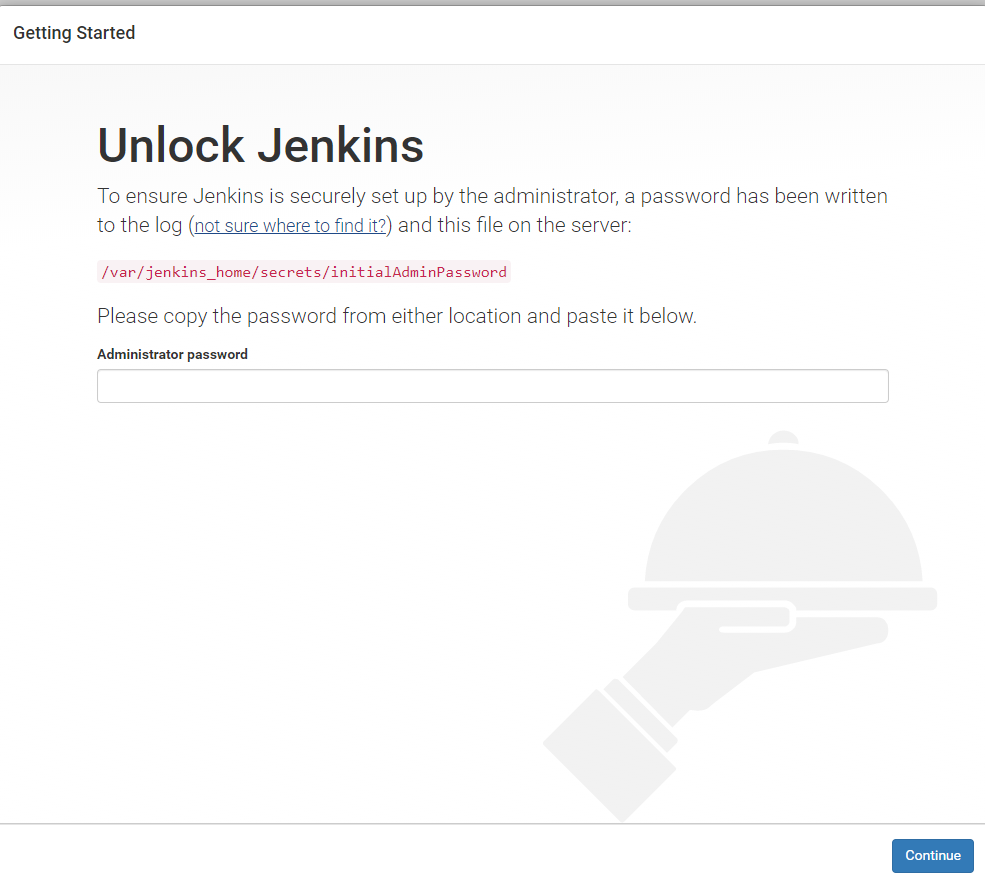
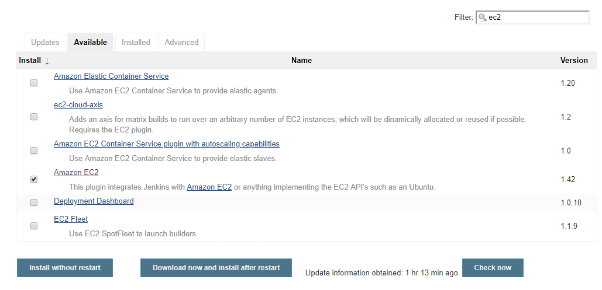
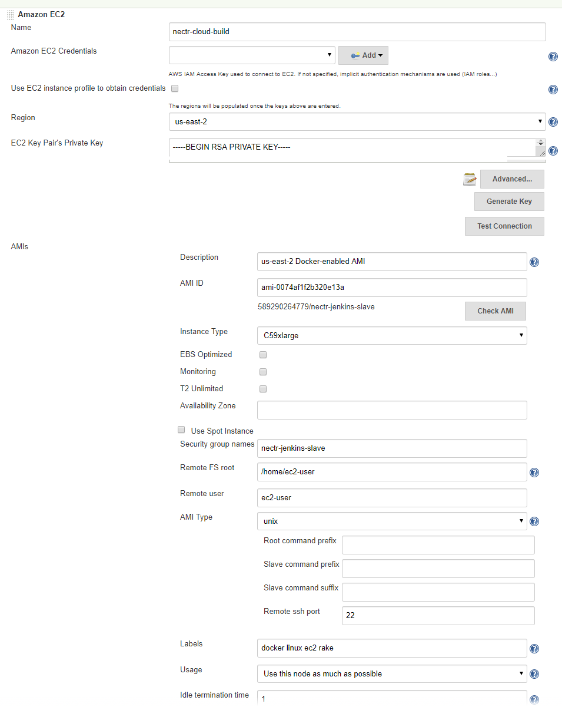

# nectr Deploy Instructions

Assumptions:

- I use us-east2; you'll need to replace this with your own region.

## Webserver Setup

### Start EC2 Instance

To make the nectr_host webserver, begin by spinning up an AWS T2.Micro instance of a baseline AMI.

- Load the [AWS EC2 Console](https://console.aws.amazon.com/ec2) and click "Launch Instance"
- Select a minimal AWS Linux instance: `Amazon Linux 2 AMI (HVM), SSD Volume Type - ami-02bcbb802e03574ba`
- Modify the network settings as needed (I use the default).
- Storage
  - Use the default root configuration
  - Create a 1GB EBS volume and mount it at `/dev/sdb`.  This will be the secure key storage.
  - Create a 10GB EBS volume at `/dev/sdc`.  This will be the persistent data storage.
- Launch the instance
- Allocate an IP address and assign it to your instance.
- SSH into the instance with `ssh -i *YOUR_PEM_FILE* ec2-user@*INSTANCE_IP_ADDRESS*`

### Provision Host

```bash
# Install required packages
sudo yum update -y
sudo amazon-linux-extras install docker
sudo yum install git rake

# Initialize our key storage volume
sudo fdisk /dev/sdb
# Create the partition with "n", use default for the rest, exit with "w"
sudo fdisk /dev/sdc
# Create the partition with "n", use default for the rest, exit with "w"
sudo mkfs.ext4 /dev/sdb1
sudo mkfs.ext4 /dev/sdc1

# Mount our volumes
sudo mkdir /var/nectr_keys /var/nectr_persistent
sudo mount /dev/sdb1 /var/nectr_keys
sudo mount /dev/sdc1 /var/nectr_persistent

```

### Open http/https to instance

- Load the EC2 Console
- Right-click the instance, choose networking->change security groups
- Create a security group allowing incoming http/https traffic **TODO: Verify this is limited to the sync VPN**
- Name this security group `nectr-jenkins-host`

#### SEC-1 SSL Certificate

Install Certbot

```bash
curl -O http://dl.fedoraproject.org/pub/epel/epel-release-latest-7.noarch.rpm
sudo yum install -y epel-release-latest-7.noarch.rpm
sudo yum install -y certbot
```

Generate your cert by running ` sudo certbot --standalone certonly` and following the directions.

Install your cert by executing

```bash
sudo mkdir -p /var/nectr_keys/ssl
sudo cp /etc/letsencrypt/*YOUR_DOMAIN*/live/fullchain.pem /var/nectr_keys/ssl/nectr.crt
sudo cp /etc/letsencrypt/*YOUR_DOMAIN*/live/privkey.pem /var/nectr_keys/ssl/nectr.key
sudo chmod 655 -R /var/nectr_keys/ssl
```

#### Create non-root user

Create a user without root permissions, give it ownership of the nectr_persistent directory, and add it to the docker group.

```bash
sudo adduser nectr
sudo chown nectr:nectr /var/nectr_persistent
sudo usermod -aG docker nectr
```

Now start the Docker daemon

```bash
sudo service docker start
sudo systemctl enable docker
```

Log in as your user and verify that you can run Docker

```bash
su nectr
docker --version
```

### Start Application Stack

Log in as your non-root user and change to the home directory

```bash
su nectr
cd
```

Pull the repository

```bash
git clone git clone https://github.com/PseudoDesign/nectr.git
```

**TODO: Create yml stack for your domain**

Launch the stack with

```bash
rake docker:stacks:nectr_dev:launch
```

Get the logs with `docker service logs nectr-nectr-dev_nginx` (or jenkins, or default)

## First Time SEtup

### Create Admin Account

Once launched, you should see the Unlock Jenkins screen prompting you for a password from the logs files.



Get this from the SSH terminal by executing `sudo cat /var/nectr_persistent/secrets/initialAdminPassword`, then terminate the SSH connection.  It is no longer needed.

### Disable SSH Access to Server

Once the Docker stack is running, the SSH connection is no longer needed.

- Load the EC2 Console
- Right-click the instance, choose networking->change security groups
- Remove the launch wizard / SSH group from this instance.

### Configure User Accounts

**TODO**

### (Optional) Test SSL

For publicly-facing domains, you can test SSL with [SSL Labs](https://www.ssllabs.com/ssltest/analyze.html?d=nectr.dev).

## Configure Jenkins Slave

Install the Amazon EC2 Jenkins plugin.



### Create an AMI

An [AMI](https://docs.aws.amazon.com/AWSEC2/latest/UserGuide/AMIs.html) is a baseline machine image.  We'll launch our build environments in them and there may need to be many of them for various projects.

I already have a publicly available AMI for my projects, `ami-0074af1f2b320e13a`

We will likely need to make a govcloud version of this AMI.

### Create AWS IAM User

Use the [Identity and Access Management](https://console.aws.amazon.com/iam/home#/home) console to create a user with the exact permissions needed for the EC2 Plugin.

```json
{
    "Version": "2012-10-17",
    "Statement": [
        {
            "Sid": "JenkinsEC2",
            "Action": [
                "ec2:DescribeSpotInstanceRequests",
                "ec2:CancelSpotInstanceRequests",
                "ec2:GetConsoleOutput",
                "ec2:RequestSpotInstances",
                "ec2:RunInstances",
                "ec2:StartInstances",
                "ec2:StopInstances",
                "ec2:TerminateInstances",
                "ec2:CreateTags",
                "ec2:DeleteTags",
                "ec2:DescribeInstances",
                "ec2:DescribeKeyPairs",
                "ec2:DescribeRegions",
                "ec2:DescribeImages",
                "ec2:DescribeAvailabilityZones",
                "ec2:DescribeSecurityGroups",
                "ec2:DescribeSubnets",
                "iam:ListInstanceProfilesForRole",
                "iam:PassRole"
            ],
            "Effect": "Allow",
            "Resource": "*"
        }
    ]
}
```

This will generate an Access Key ID/Private Key pair.  Use this to create your Amazon EC2 Credentials in Jenkins.

### Create Security Group

Our slave instances will need a network security policy.  Create a new one with the EC2 console, named `nectr-jenkins-slave`.  Allow inbound traffic from port 22 of the `nectr-jenkins-host` security group.

### Slave Settings in Jenkins

The inline documentation describes this section better than I could; just use my settings for my AMI:



For the private key, generate a unique key for this application using the EC2 console.

Online [guides](https://blog.iseatz.com/ec2-plugin-jenkins-automatically-provision-slaves/) explain the details of these settings.

## Run a Build
